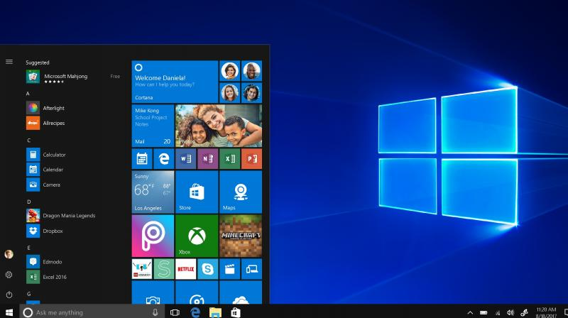
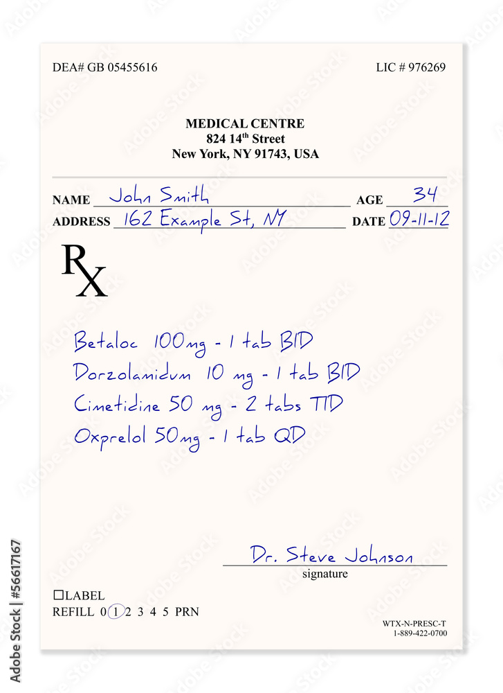
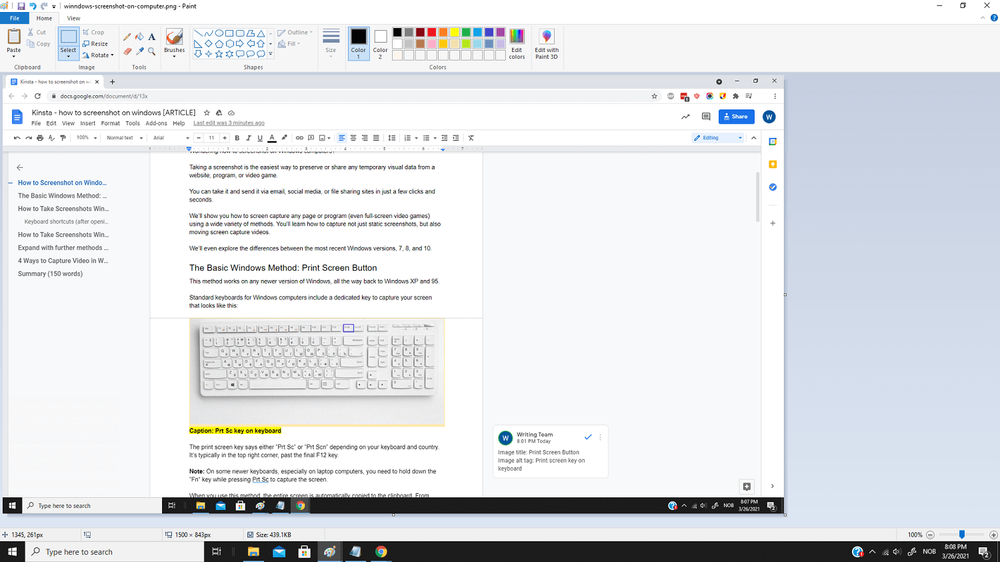
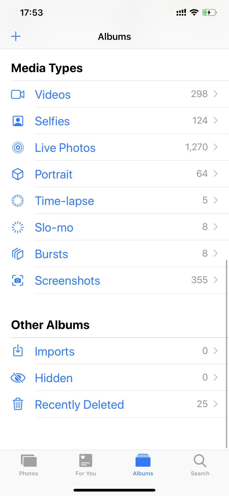

# SnapSort

SnapSort can help you identify & sort images into different directories. It uses OpenAI's CLIP model locally. No internet connection required.

## Features

- **Automated Image Classification**: Leverages CLIP's deep learning model for precise image recognition.
- **Custom Sorting Labels**: Allows flexibility in sorting images into user-defined categories.
- **Batch Processing**: Efficiently handles large volumes of images.
- **Dry Run Mode**: Test sorting criteria without moving files to ensure precision.
- **Simple CLI**: Easy-to-use command-line interface for seamless operation.

## Installation

SnapSort can be installed using poetry. To install, clone the repository and run the following commands:

```
poetry shell
poetry install
```


## Usage

```
python app.py --dir /path/to/your/images
```

The default labels are for a use-case that detects screenshots & receipts and sorts them into separate folders. Any other images are left in the original directory. 

```
[
    "a screenshot of a software interface or a screen capture from phone",
    "a photo of an invoice or a receipt",
    "a photo of a real-world scene, an object, a person, or any image not fitting the description of a screenshot, receipt, or invoice",
]
```

The last label should be a catch-all label for images that do not match any of the other labels.

The threshold is the minimum confidence score required for an image to be sorted into a category. You need to experiment with this value to find the best threshold for your use case. Set it with `--threshold` flag. The default value is 0.5.

To dry run without moving files, add the `--dry-run` flag.

Set an appropriate batch size with the `--batch-size` flag. The default value is 4.

## Demo

```
python app.py demo/ -t 0.5 --dry-run
```

---

|    | file                                                                                                                                                    | class                                                                                                                             | probability   | status          |
|----|---------------------------------------------------------------------------------------------------------------------------------------------------------|-----------------------------------------------------------------------------------------------------------------------------------|---------------|-----------------|
|  0 |                  | a screenshot of a software interface or a screen capture from phone                                                               | 0.98          | Moved (Dry Run) |
|  1 |                                  | a photo of an invoice or a receipt                                                                                                | 0.97          | Moved (Dry Run) |
|  2 |                                                    | a photo of a real-world scene, an object, a person, or any image not fitting the description of a screenshot, receipt, or invoice |               | Skipping        |
|  3 |                                                                                                | a screenshot of a software interface or a screen capture from phone                                                               | 0.76          | Moved (Dry Run) |
|  4 |                                                                                                          | a photo of an invoice or a receipt                                                                                                | 0.99          | Moved (Dry Run) |
|  5 |  | a photo of a real-world scene, an object, a person, or any image not fitting the description of a screenshot, receipt, or invoice |               | Skipping        |
|  6 |                                                                                          | a screenshot of a software interface or a screen capture from phone                                                               | 0.63          | Moved (Dry Run) |
|  7 |                          | a photo of a real-world scene, an object, a person, or any image not fitting the description of a screenshot, receipt, or invoice |               | Skipping        |
|  8 |                                                                                                        | a screenshot of a software interface or a screen capture from phone                                                               | 0.76          | Moved (Dry Run) |
|  9 |                                                                                                          | a photo of a real-world scene, an object, a person, or any image not fitting the description of a screenshot, receipt, or invoice |               | Skipping        |
| 10 |                                                                                        | a photo of a real-world scene, an object, a person, or any image not fitting the description of a screenshot, receipt, or invoice |               | Skipping        |
| 11 |                                  | a photo of a real-world scene, an object, a person, or any image not fitting the description of a screenshot, receipt, or invoice |               | Skipping        |


## Requirements

- Python 3.6+
- PyTorch
- PIL (Python Imaging Library)
- transformers by HuggingFace

## Contributing

We welcome contributions to SnapSort. Feel free to open a pull request or issue.

## License

SnapSort is made available under the MIT License.
